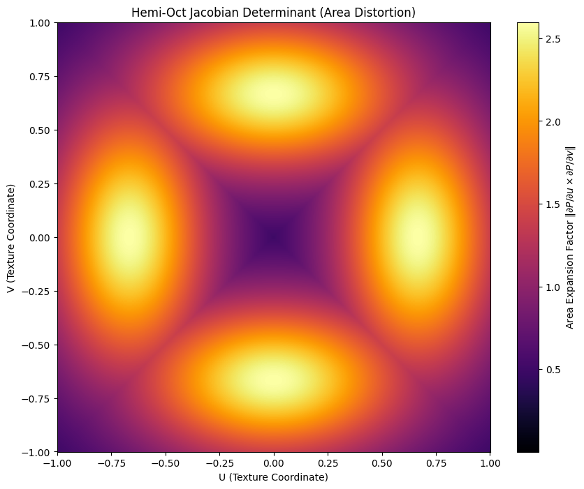

# The Invariance of Dithering Efficiency Under Non-Conformal Projections

> **Context:** This repository contains the source code, simulation framework, and LaTeX compilation for a research paper produced during the **"Fast-Track to Research Writing"** workshop at  Université Paris-Saclay (Nov 2025 – Jan 2026).



## 📄 Summary

**Octahedral encoding**, the standard for normal map compression in real-time rendering, significantly distorts surface density, yet **uniform dithering** remains the industry default. This project investigates whether this default is merely an engineering compromise or a theoretically optimal strategy.

By contrasting standard methods against a Jacobian-weighted theoretical foil (**Anisotropic Jacobian-Weighted Dithering** or **AJWD**), we demonstrate that explicit density correction is mathematically redundant. Our analysis reveals that the projection transforms both dithering noise and quantization error identically. We conclude that standard spatially uniform dithering is the theoretically optimal strategy for masking quantization artifacts in Hemi-Octahedral maps.

[**Read the full paper (PDF)**](./dithering_in_octahedral.pdf)

## 🔬 Research & Findings

This project was a "stress test" for normal map quantization. We implemented a custom WebGPU rendering engine to compare different dithering strategies against a 32-bit floating-point Ground Truth.

### Key Results

1. **The Anisotropy Fallacy:** We mathematically proved and empirically showed that trying to force isotropic (circular) noise on the sphere surface using Jacobian weighting is sub-optimal.
2. **Invariance:** The efficiency ratio (Noise Magnitude / Quantization Step) remains invariant across the projection ($~1.0$) without any external weighting.
3. **Pareto-Optimality:** Standard Uniform TPDF (Triangular Probability Density Function) dithering achieves the best balance of visual masking and structural similarity (FSIM score: **0.9314**) compared to the computationally expensive AJWD.

| Method | Pole FSIM | Mid-Quad FSIM | Diagonal FSIM | Cost (Instr.) |
| :--- | :--- | :--- | :--- | :--- |
| **Uniform (TPDF)** | **0.9176** | **0.8932** | **0.9314** | **~20** |
| AJWD (Full) | 0.9176 | 0.8788 | 0.9199 | ~74 |

## 🎓 The Workshop: Fast-Track to Research Writing

This work was produced by **Rémi Millerat--Gallot** as part of the Initiation to Research workshop supervised by **Matthias Függer** and **Thomas Nowak**, at **Université Paris-Saclay**.

**Format:** A 6-week research sprint (Nov 2025 - Jan 2026).

**Objective:** To take a research question on a subject we had 0 knowledge about, from concept to a polished, publishable-standard paper under tight time constraints, utilizing AI tools effectively at all stages (literature exploration, planning, implementation, writing,...) while maintaining rigorous critical judgment.

## 📂 Repository Structure

```text
DITHERING-IN-OCTAHEDRAL/
├── comparison/          # Comparison images and result artifacts
│   ├── images/          # Image crops of the highlights to evaluate
│   └── evaluator.py     # Python script for computing FSIM metrics
├── implementation/      # The core WebGPU/Three.js simulation framework
│   ├── encoding.wgsl    # Custom shader implementing Encodings & Dithering
│   └── main.js          # Main entry point for the testbed
├── latex/               # LaTeX source code for the research paper
│   ├── main.tex
│   └── images/
├── hemi_oct_distortion.ipynb # Jupyter notebook for Jacobian/Anisotropy visualizations
└── dithering_in_octahedral.pdf # Final output paper
```

## 🚀 Getting Started

### Prerequisites

* Node.js and npm (for the web simulation).
* A browser with **WebGPU** support.
* Python 3.x (for the evaluator/notebook).

### Running the Simulation

1. Navigate to the implementation folder

2. Start a local server:

    ```bash
    npm install
    npx vite
    ```

3. Open `http://localhost:5147` in your browser.

### Reproducing Plots

To generate the Jacobian distortion heatmaps found in the paper:

```bash
pip install matplotlib numpy
jupyter notebook hemi_oct_distortion.ipynb
```

### Evaluating the images with FSIM

The evaluation script uses `pyiqa` (which depends on PyTorch). It is recommended to use a virtual environment.

1. ```bash
    pip install pyiqa
    cd .\comparison\
    ```

2. You need to have the ground truth image in the same folder as the image(s) to evaluate.
    For a single image:

    ```bash
    python .\evaluator.py .\images\<image_file.png>
    ```

    For many images:

    ```bash
    python .\evaluator.py .\images\<folder_name>\
    ```

## 📚 Citation

If you find this work useful, please cite the workshop paper:

```bibtex
@article{milleratgallot2026dithering,
  title={The Invariance of Dithering Efficiency Under Non-Conformal Projections},
  author={Millerat-Gallot, Rémi},
  journal={Initiation to Research Workshop, Université Paris-Saclay},
  year={2026},
  month={January}
}
```

## ⚖️ License

The source code and WebGPU simulation framework in this repository are licensed under the **MIT License**. See the [LICENSE](./LICENSE) file for details.

The text, figures, and LaTeX source of the research paper (`dithering_in_octahedral.pdf` and `latex/` directory) are licensed under a **Creative Commons Attribution-ShareAlike 4.0 International License (CC BY-SA 4.0)**.
